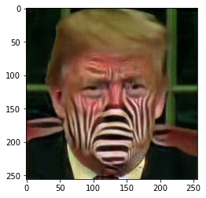

## !PiedPiper
###### Empower users to upload their videos in the public domain while upholding privacy. 
</img>

###### <i>Collaborators</i>: [Kaustav Halder](https://github.com/kaustavha), [Yash Sinha](https://github.com/ysinha1), [Siddhartha Datta](https://github.com/dattasiddhartha)

#### Stenography

</img>
</img>
</img>
</img>

Accepts the user's original video, obfuscates the video with a stenographic mask, allows user to store mask array, then allows user to retrieve mask array to decrpyt the video each time they wish to view it.

Install dependencies with `pip install -r requirements.txt`. Run stenographic mask generator `stenographic_mask_generator.py` to return mask arrays (refer to `example_stenography.ipynb` for example demonstration).

Download weights from
[here](https://drive.google.com/drive/folders/1ANqflh1dxSfgdFwvH1mZqZ8_vPS6WipB?usp=sharing).
* `cycle_gan/checkpoints` placed in `vision/`

Stenography functionality currently supported:
* CycleGAN ( `"apple2orange", "horse2zebra", "style_monet", "style_vangogh", "summer2winter_yosemite"`)
